# Hackathon

## Generated Graphic Output

An animated GIF in Notion snazzified with the help of Picsart's APIs (e.g. changing background color and adding effects):

## Running the Demo Code

Open a Visual Studio Code DevContainer then `python backend/src/domain/test.py`

## Inspiration
Popular business-savvy applications such as Notion permit embedding of graphics, but are lacking in features when it comes to snazzifying those graphics beyond basic manipulations like resizing. Headline graphics have to be interesting and eye-catching in order to inspire attention to the document and content at hand. The Picsart API can be leveraged in conjunction with APIs exposed by SaaS like Notion to automagically snazzify graphics.

## What it does
We aimed to create a backend integration that pulls content from Notion, scans it for graphics, snazzifies those graphics using Picsart's APIs such as Style Transfer, and injects the snazzified graphic back into the document by updating its embedded image URLs. By having a backend integration running silently on a server, the snazzification process works like automagic from users' perspectives.

## How we built it
We wrote a Python program, intended to be run on a server and triggered periodically by something like a cron job or webhook.

## Challenges we ran into
Not enough time!

## Accomplishments that we're proud of
We like the pieces we created and we can see how they could fit together to deliver the promised automagic snazzification of headline graphics.

## What we learned
Graphic manipulation in popular business-savvy applications such as Notion is an underserved function. People commonly paste graphics into documents, but lack effective tooling to make headline graphics and consequently their documents really stand out. Snazzy headline graphics captures both eyeballs and attention!

## What's next for Picturesque Beautifications
We would like to further refine the idea beyond a hackathon to really derive value by plugging the gap that exists today in terms of making it easy to create attention-grabbing documents that stand out through the use of snazzy graphics that are not yet easy enough to create today.

## Input Graphics

A series of still images that get enhanced via Picsart then combined into a single animated GIF for ultimate snazziness:

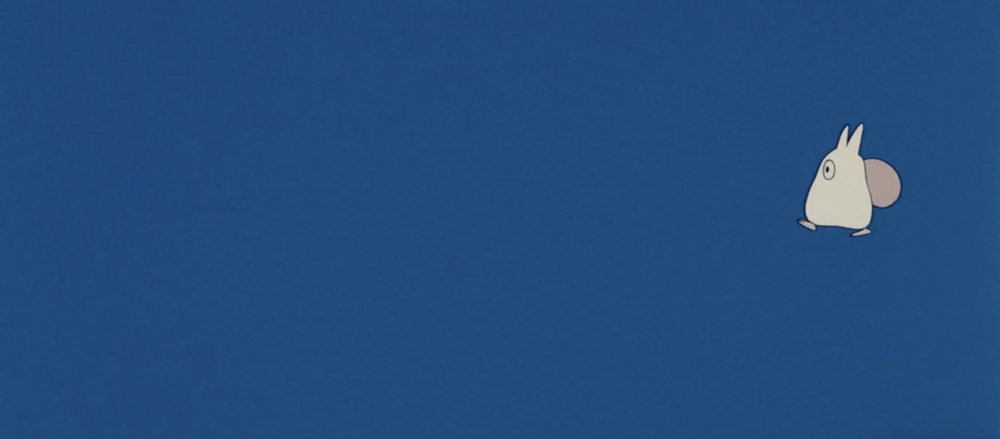

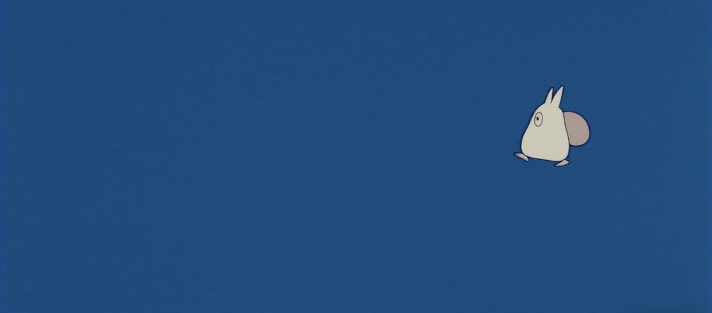

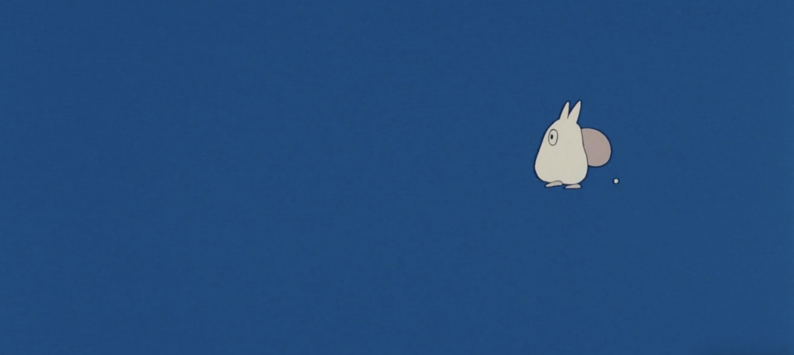

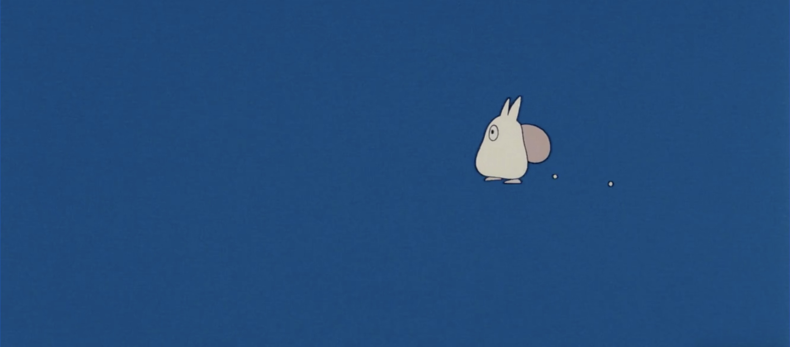

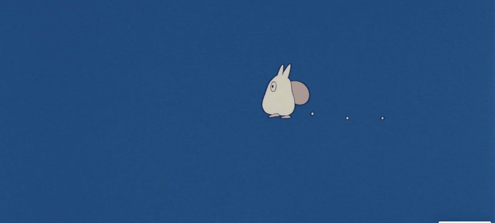

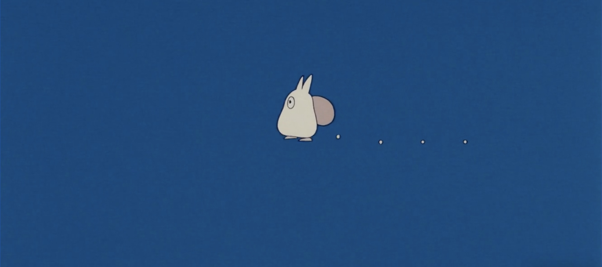

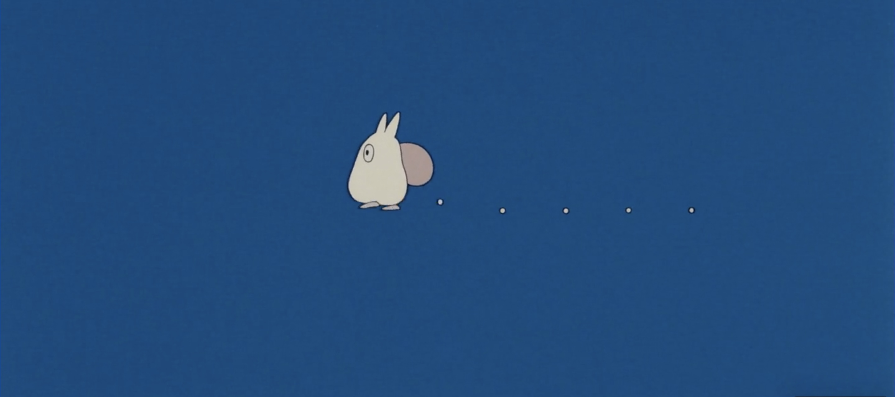

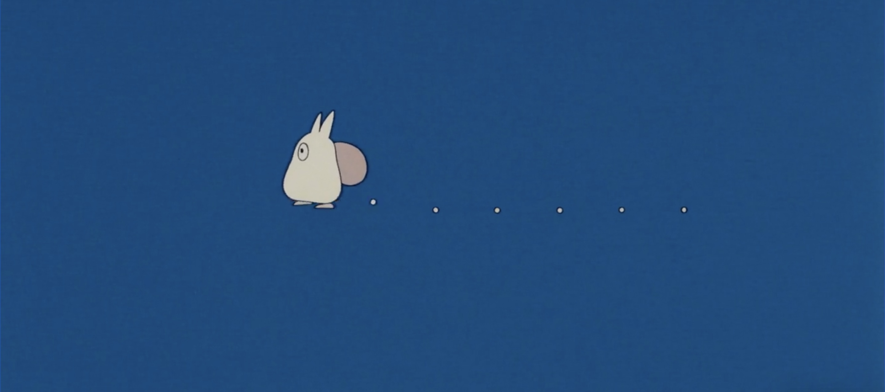

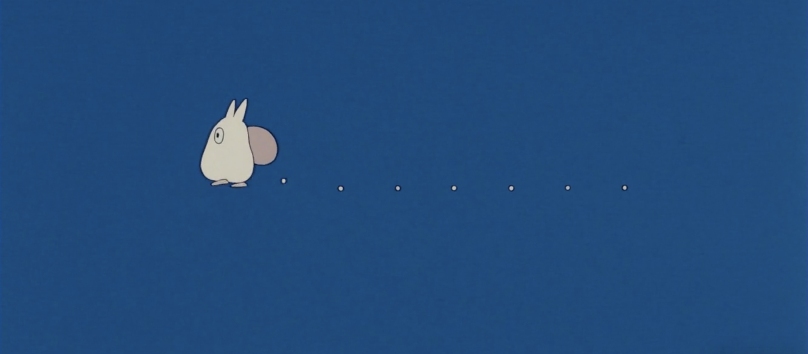

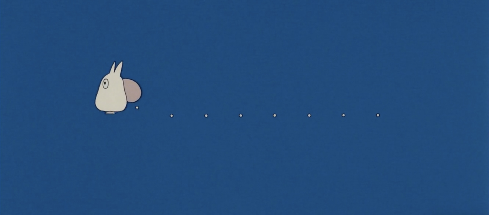

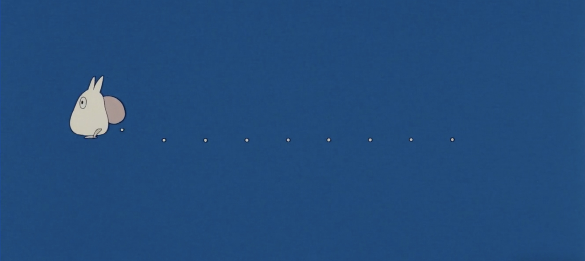

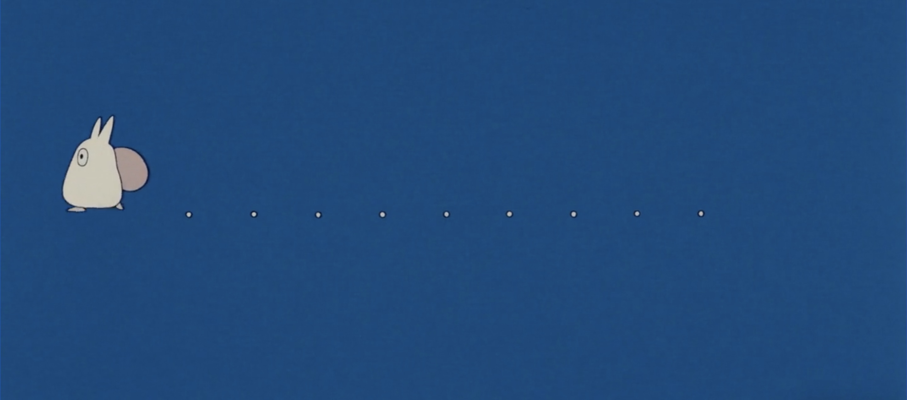

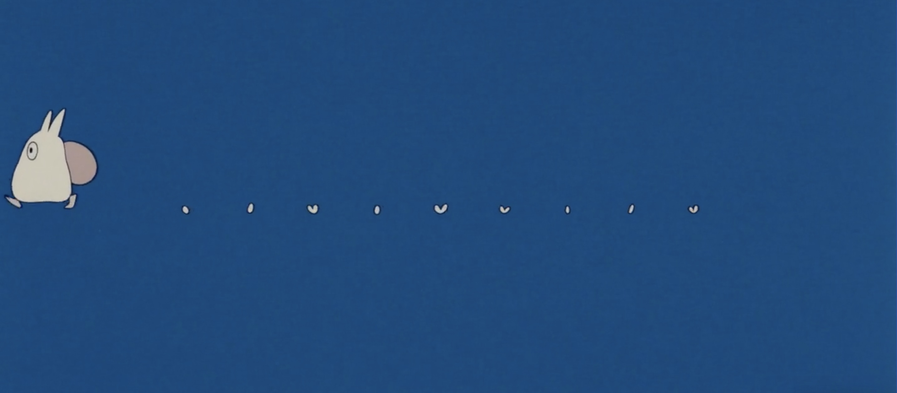

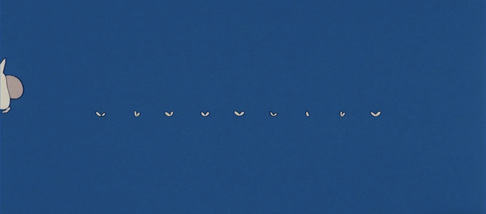

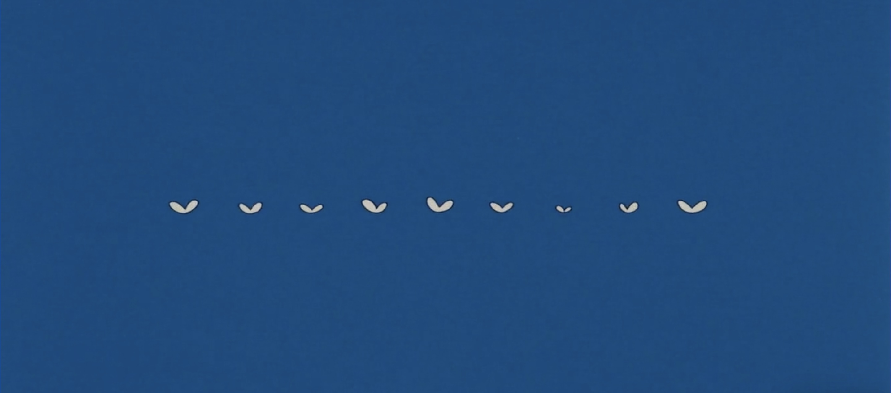

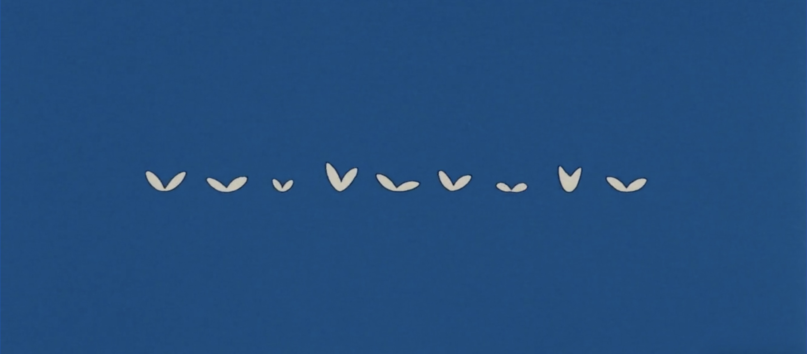
